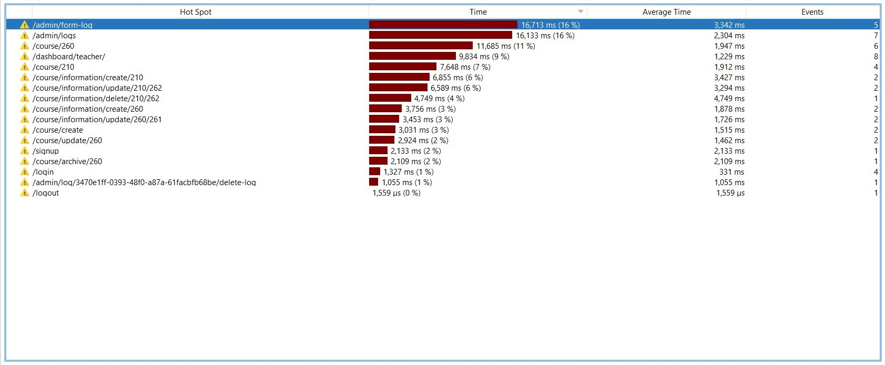
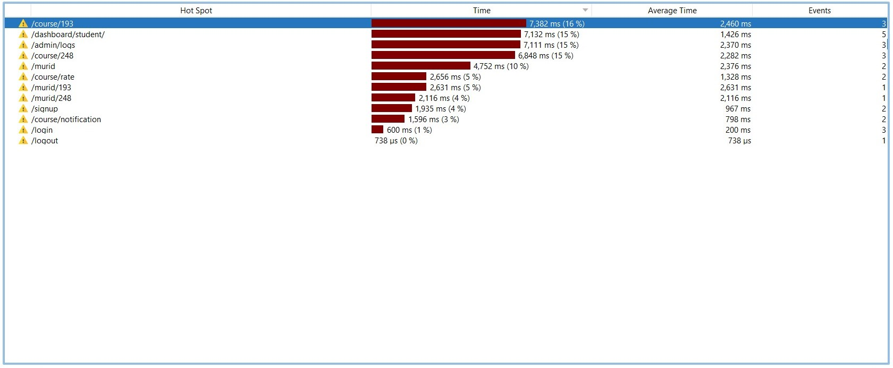

# [Meja Belajar (A10)](https://mejabelajar.herokuapp.com/)

## Branch Master

## Branch Staging

## Anggota
2006463004 - Ivan Phanderson

2006529114 - Adillah Putri

2006473913 - Markus Leonard Wijaya

2006595993 - Adeline Sonia Sanusie

## Description
Aplikasi ini dirancang untuk kegiatan belajar dan mengajar secara online serta digunakan oleh guru dan murid. Tujuan utamanya adalah agar murid dapat memperoleh solusi untuk setiap kesulitan yang ditemukan dalam bidang studi tertentu.

## Sprint 1
1. Registration and Login
   - Registrasi dan Login sudah diimplementasi untuk setiap role.
   - Backend sudah terintegrasi dengan frontend.
2. Dashboard
   - Dashboard belum diimplementasi.
3. CRUD Course
   - Pada fitur ini, guru dapat membuat course dengan constraint 1 guru hanya dapat memiliki 1 course. Hanya guru pemilik course dan murid yang meng-enroll course tersebut yang dapat mengakses course tersebut. Guru memiliki akses tambahan untuk mengupdate ataupun menghapus course. Pada sprint 1, fitur ini sudah terimplementasi pada bagian backend dan sudah terhubung dengan frontend. Akan tetapi, fitur ini belum terintegrasi dengan murid sehingga murid belum dapat mengakses halaman course. Error handling pada sprint ini juga belum terimplementasi dengan baik.
   - Tests pada fitur ini akan dikerjakan pada sprint 3 setelah terintegrasi dengan fitur-fitur lain.
4. Course Registration
   - Fitur ini memungkinkan murid agar dapat melakukan registrasi course. Pada sprint 1, fitur ini masih diterapkan dalam bentuk backend.
   - Tests pada fitur ini akan dikerjakan pada sprint 3 setelah terintegrasi dengan fitur-fitur lain.
5. Rate a course
   - Fitur ini memungkinkan murid agar dapat memberi rate untuk course. Pada sprint 1, fitur ini masih diterapkan dalam bentuk backend.
   - Tests pada fitur ini akan dikerjakan pada sprint 3 setelah terintegrasi dengan fitur-fitur lain.
6. Validate new user accounts (teachers, students)
   - Fungsionalitas backend untuk user activation sudah selesai.
7. Make a form that can be filled out by the teacher (teacher's log)
   - Model Log sudah dibuat dan guru sudah bisa create log. delete dapat dilakukan oleh guru dan admin.

## Sprint 2
1. Registration and Login
   - Penambahan validasi pattern email saat registrasi.
   - Admin akan di-redirect ke dashboardnya saat berhasil login. Untuk guru dan murid dashboard belum tersedia.
   - Admin dapat men-generate token yang bisa dipakai untuk registrasi admin.
   - Perbaikan pada url setelah berhasil logout (sebelumnya /login?logout menjadi /login).
2. Dashboard
   -  Dashboard untuk admin sudah ada.
3. CRU Course
   - Pada fitur ini, guru dapat membuat course dengan constraint 1 guru hanya dapat memiliki 1 course. Hanya guru pemilik course dan murid yang meng-enroll course tersebut yang dapat mengakses course tersebut. Guru memiliki akses tambahan untuk mengupdate course. Pada sprint 2, fitur delete course ditiadakan dengan pertimbangan untuk mencegah murid yang sudah meng-enroll course, tetapi coursenya tiba-tiba dihapus. Fitur ini juga sudah terintegrasi dengan role murid. Error handling juga sudah diperbaiki sehingga memberikan feedback yang lebih baik kepada pengguna.
   - Tests pada fitur ini akan dikerjakan pada sprint 3 setelah terintegrasi dengan fitur-fitur lain.
4. Archive Course
   - Fitur ini ditambahkan pada sprint 2 sebagai pengganti fitur delete course. Hanya guru pemilik course.yang dapat mengakses fitur ini. Ketika guru meng-archive course miliknya, maka course tersebut tidak dapat lagi di update oleh guru yang bersangkutan. Selain itu, murid juga sudah tidak dapat meng-enroll course ini lagi dan guru dapat membuat course baru. Error handling terkait fitur ini sudah diimplementasikan sehingga memberi feedback yang baik kepada pengguna
   - Tests pada fitur ini akan dikerjakan pada sprint 3 setelah terintegrasi dengan fitur-fitur lain.
5. Course Notification
   - Murid akan diberikan notifikasi ketika ada informasi baru ataupun informasi yang baru diupdate oleh guru. Fitur ini baru ditambahkan pada sprint 2 dengan tujuan murid tidak ketinggalan terhadap perkembangan course yang di-enroll. Implementasi fitur ini sudah menerapkan observer pattern sehingga setiap ada create atau update pada course information, murid yang sudah ter-enroll akan dinotifikasi.
   - Tests pada fitur ini akan dikerjakan pada sprint 3 setelah terintegrasi dengan fitur-fitur lain.
6. Course Registration
   - Fitur ini sudah terhubung dengan frontend, murid dapat mengambil banyak course. Murid tidak dapat melakukan enroll course lebih dari 1 kali.
   - Tests pada fitur ini akan dikerjakan pada sprint 3 setelah terintegrasi dengan fitur-fitur lain.
7. Rate a course
   - Fitur ini sudah terhubung dengan frontend, murid dapat memberi 1 rating untuk 1 course dan rate ditampilkan pada halaman course.
   - Tests pada fitur ini akan dikerjakan pada sprint 3 setelah terintegrasi dengan fitur-fitur lain.
8. Validate new user accounts (teachers, students)
   - Fitur ini sudah terhubung dengan frontend, dan hanya admin saja yang dapat mengakses fitur ini untuk melakukan aktivasi akun user.
9. Make a form that can be filled out by the teacher (teacher's log)
   - Fitur ini sudah terhubung dengan frontend, dan hanya guru saja yang dapat mengakses fitur ini untuk melakukan create log. Ada perubahan attribute Log dari sprint 1 yaitu jam menjadi waktu mulai dan waktu selesai. error handling sudah diimplementasi
10. RUD Log
      - terdapat tampilan untuk menampilkan daftar log yang dimiliki guru dan murid. Untuk admin dapat melihat semua log. guru dan admin dapat melakukan delete, admin dan murid dapat melakukan update (berupa status).
      - memperbaiki tampilan tabel daftar log untuk masing-masing role.

## Sprint 3
1. Registration and Login
   - Sedikit modifikasi tampilan pada halaman registrasi dan login
2. Dashboard
   - Mengimplementasi dashboard untuk guru dan murid
   - Mengimplementasi test untuk dashboard admin, guru, dan murid
3. CRU Course
   - Mengimplementasi test untuk fitur CRU course dan melakukan bug fixing terkait masalah menghapus suatu informasi dalam course. Menambahkan navbar pada setiap fitur menggunakan navbar yang telah dibuat oleh adillah
4. Archive Course
   - Mengimplementasi test untuk fitur archive course.
5. Course Notification
   - Mengimplementasi test untuk fitur course notification.
6. Course Registration
   - Mengimplementasi test untuk fitur course registration.
7. Rate a course
   - Rate yang ditampilkan adalah rata-rata rate yang diberikan murid.
   - Mengimplementasi test untuk fitur rate course.
8. Validate new user accounts (teachers, students)
   - Mengimplementasi test untuk fitur validasi user
9. Make a form that can be filled out by the teacher (teacher's log)
   - Menambahkan navbar pada front-end
10. RUD Log
    - Menambahkan navbar pada front-end

## Profiling Meja Belajar
1. Guru

Page yang paling lama response timenya adalah delete information course karena:
   - mengecek user sudah logged in atau belum
   - memeriksa akses pengguna
   - mencari object course information berdasarkan idnya
   - mencari seluruh notifikasi pengguna yang terhubung dengan informasi tersebut
   - menghapus seluruh notifikasi pengguna
2. Murid

Page yang paling lama response timenya adalah course karena:
   - mengecek user sudah logged in atau belum
   - validasi user memiliki akses atau tidak
   - mengecek role user (student atau teacher)
   - mengambil data suatu course
   - mengambil list informasi dari suatu course
   - menghitung rata-rata dari rating
   - mengecek usernya sudah memberi rate ke course atau belum